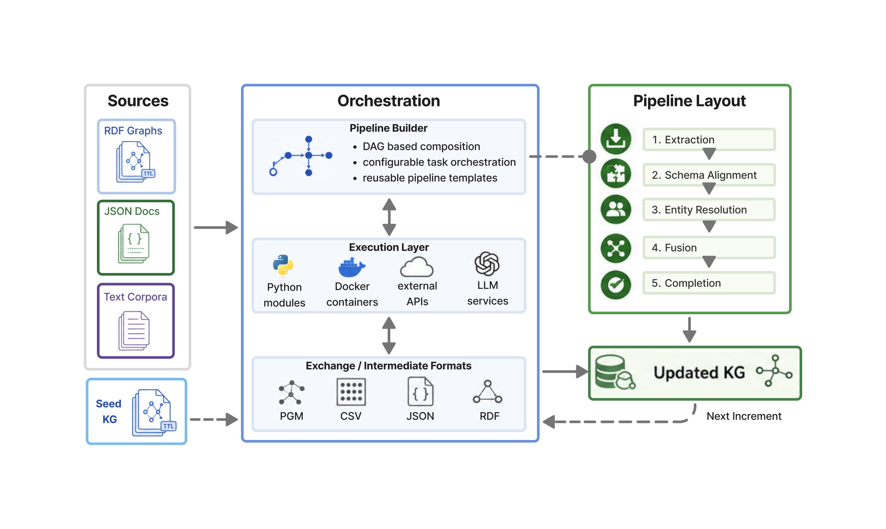

# KGpipe framework documentation

KGpipe is a framework to define pipelines for data integration into knowledge graphs. The framework enables you to compose existing tools and implementations into modular pipelines that integrate heterogeneous data sources into a unified knowledge graph.

The framework is organized into three main subpackages: `kgpipe` contains the core framework functionality including CLI, common utilities, execution backends, and evaluation components. `kgpipe_tasks` provides task implementations for cleaning, construction, entity resolution, schema alignment, and text processing. `kgpipe_llm` includes LLM-based task implementations and utilities.

**Current version**: 0.7.0  
**Python**: >= 3.12



## Quickstart

Start here: [Quickstart guide](quickstart.md)

Minimal “happy path” (install + discover + inspect what’s available):

```bash
pip install -e .
kgpipe discover --all --show-results
kgpipe list --type tasks
kgpipe list --type metrics
```

Create a new experiment project (recommended):

```bash
cd experiments/examples
./init.sh
```

## How to use KGpipe (docs map)

- Define tasks: [Task specification](tasks.md)
- Build and run pipelines: [Pipelines](pipelines.md)
- Configure runs and task parameters: [Configuration](configuration.md) and [Parameters](parameters.md)
- Evaluate generated KGs: [Evaluation](evaluation.md) and [Metrics](metrics/)
- Understand the internal “PipeKG”: [Meta KG](metakg.md)

## Other Links

- [Reproducing the movie kg experiments for 15 pipelines](reproduce.md) (rdf, json, text)
- [Adopting KGpipe (integrating existing pipelines/tools)](adoption.md)
- [UI / viewer](view.md)

## Docs backlog

Open items live in `TODO.md` (High/Medium/Low priority). Keep the landing page focused on user-facing docs.