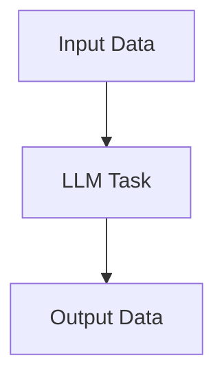

# Collection of LLM Tasks for KG integration

A collection of tasks for data integration into Knowledge Graph using Large Language Models.

## Related Work
- OntoAligner Framework https://github.com/sciknoworg/OntoAligner
- LLM-KGBench Framework https://github.com/AKSW/LLM-KG-Bench

## Pipeline Layout

## List of included Tasks

name  | comment
--- | ---
ontology_matching_sampled | sampling two kg snippets and presenting the LLM to 

ontology_matching_sampled_single | |
ontology_matching_embedd | |
entity_matching_embedd | |
mapping_direct | |
mapping_target | |
mapping_python_direct |
mapping_python_target |
linking_embedd | |
type_extraction | |
text_extraction_direct | |
text_extraction_target | |
clean_concistency_type | |
fusion... | ? | ? 

## Setup

Selection of tested Metrics:

- Quality: Acc, Cov, Cons, +Robustness
- Resource: Costs, Runtime

Selection of LLMs

- gpt-mini
- gpt-nano
- llama-70B
- 405B